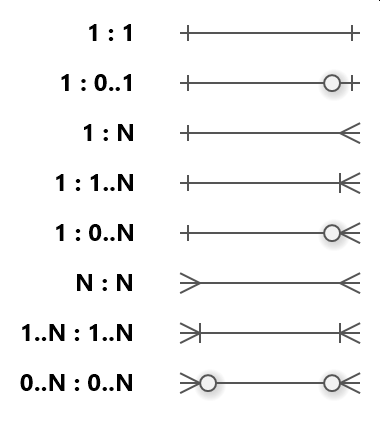

*//------------------------------------------------------------DATABASE FUNDAMENTALS PART 2------------------------------------------------------------//*

 # Data Manipulation and Modification:
   - This is the process of adding, updating and deleting data from a database.
   - This is done using the following SQL statements:
     * INSERT INTO
     * UPDATE
     * DELETE
   - Up until now, we have used SELECT to retrieve data from a database and INSERT INTO to add data to a database
   - Now, we will use UPDATE and DELETE to change the data in a database.

 # INSERT INTO:
   - INSERT INTO is used to add data to a database.
   - The syntax for the statement looks like this:
     * INSERT INTO [table_name] ( [column1], [column2], [column3], ... )
       VALUES ( [value1], [value2], [value3], ... );  
   - INSERT INTO inserts a new row into the table.
   - The columns that are not specified will be filled with the default value, or NULL if no default value is specified.

*//------------------------------Example: INSERT INTO------------------------------//*
--------------------------------------------------------------------------------------
                                    Input:
--------------------------------------------------------------------------------------
CREATE TABLE students (
  id INTEGER PRIMARY KEY,
  first_name TEXT,
  last_name TEXT,
  grade INTEGER
);

INSERT INTO students (first_name, last_name, grade)
VALUES 
('John', 'Doe', 90),
('Jane', 'Doe', 95),
('Sally', 'Smith', 100);

SELECT * FROM students;
-------------------------------------------------------------------------------
                                  Output:
-------------------------------------------------------------------------------

1|John|Doe|90
2|Jane|Doe|95
3|Sally|Smith|100 

*//--------------------------------------------------------------------------------//*

 # UPDATE:
   - This is used to update existing information in a database.
   - The syntax for the statement looks like this:
     * UPDATE [table_name]
       SET [column1] = [value1], [column2] = [value2], ...
       WHERE [condition];
   - "WHERE" is used to specify which rows to update.
   - If "WHERE" is omitted, all rows in the table will be updated.

*//------------------------------Example: UPDATE------------------------------//*
---------------------------------------------------------------------------------
                                    Input:
---------------------------------------------------------------------------------
CREATE TABLE students (
  id INTEGER PRIMARY KEY,
  first_name TEXT,
  last_name TEXT,
  grade INTEGER
);

INSERT INTO students (first_name, last_name, grade)
VALUES 
('John', 'Doe', 90),
('Jane', 'Doe', 95),
('Sally', 'Smith', 100);

UPDATE students
SET grade = 100
WHERE first_name = 'John';

SELECT * FROM students;
---------------------------------------------------------------------------------
                                  Output:
---------------------------------------------------------------------------------

1|John|Doe|100
2|Jane|Doe|95
3|Sally|Smith|100

*//---------------------------------------------------------------------------//*  

 # DELETE:
   - This is used to delete existing data from a database.
   - The syntax is similar to the UPDATE statement and is as follows:
     * DELETE FROM [table_name]
       WHERE [condition];
   - "WHERE" is used to specify which rows to update.
   - If "WHERE" is omitted, all rows in the table will be updated.

*//------------------------------Example: DELETE------------------------------//*
---------------------------------------------------------------------------------
                                    Input:
---------------------------------------------------------------------------------
CREATE TABLE students (
  id INTEGER PRIMARY KEY,
  first_name TEXT,
  last_name TEXT,
  grade INTEGER
);

INSERT INTO students (first_name, last_name, grade)
VALUES 
('John', 'Doe', 90),
('Jane', 'Doe', 95),
('Sally', 'Smith', 100);

DELETE FROM students
WHERE first_name = 'John';

SELECT * FROM students;
-------------------------------------------------------------------------------
                                  Output:
-------------------------------------------------------------------------------

id          first_name  last_name   grade
----------  ----------  ----------  ----------
2           Jane        Doe         95
3           Sally       Smith       100

*//-------------------------------------------------------------------------//* 

 # DATABASE DESIGN AND NORMALIZATION:
   - Database Design is the process of designing a database schema.
   - Database Schema is a collection of tables that are related to each other.
     * This is also referred as a relational database.
   - Normalization is the process of organizing data in a database.
   - The goal of normalization is to reduce data redundancy and improve data integrity.
   - This is important because it helps ensure that the data in the database is accurate and consistent.

 # DATABASE SCHEMA DESIGN:
   - There are different ways how to design a database schema.
   - The most common way is to use a relational database.
   - In relational databases, tables represent an entity. 
   - Each row in the table represents an instance of that entity.
   - Each entity has attributes that describe the entity.
   - Attributes are represented by the columns in the table.
   - Each attribute has a data type and a default value.
   - The data type specifies what kind of data can be stored in the attribute.
   - The default value specifies what value should be used if no value is specified.
   - The main purpose of a database schema is to define the structure of a database.
   - It defines the tables, columns, data types, and relationships between the tables.
   - It also defined the constraints that are applied to the data in the database.
   - The constraints are use do to ensure that the data in the database is accurate and consistent. 
   - When it comes to designing a database schema, there are few things to consider:
     * What are the entities in the database?
     * What are the attributes of each entity?
     * What are the relationships between the entities?

 # CARDINALITY:
   - Relationships are the main reason to use a relational database, and they are used to connect the tables to each other in the database.
   - This is called Cardinality, the number of instances of one entity that can be related to one instance of another entity.
     * An entity is a thing / object that can be identified by its attributes. 
     * Attributes are characteristics of an entity
   - Ex: A customer is an entity, and a customer has attributes such as name, address, phone number, and email.
   - A relationship is a connection between two entities.
   - Ex: A customer can have multiple orders. This is a relationship between the customer and order entities.
   - The relationship is represented by a l ine connecting hte customer and  order entities, with a single crow's foot on the other side of the line.
   - Relationships can be represented by other symbols as well:
     * One to one (1:1)                 Each entity in the relationship will have a singled related entity 
       + Ex: Each person has a unique passport number. Each passport number is assigned to ONLY one person.
     * One to zero (1:0..1)             An entity on one side of the relationship can have zero or one related entity on the other side.
       + Ex: A user may have zero or one profile pictures in an application. Some users may choose not to upload a profile picture while others have EXACTLY one.
     * One to many (1:N)                An entity on one side can have many related entities on the other side. 
       + Ex: A book has at least one author, but it can have several authors. A book cannot have 0 authors.
     * One to zero to many (1:0..N)     An entity on one side may have zero, one, or many related entities on the other side.
       + Ex: A teacher can teach 0 (if they're currently not assigned to a class), one, or several classes.
     * Many to many (N:N)               Entities on both sides can have many related entities on the other side.
       + Ex: A student can enroll in multiple classes, and each class can have multiple students enrolled.   
     * Many to many (1..N:1..N)         Each entity on both sides will have AT LEAST one related entity on the other side, and could have many.
       + Ex: A business partnership where each business must have at least one partner, and each partner must be engaged with at least one business.
     * Many to many (0..N:0..N)         Entities on both sides may have zero, one, or many related entities on the other side.
       + Ex: Social media users can join many groups, and each group can have many users. However, it is also possible that a user belongs to no group, or a group currently has no users. 

 # CROWS FOOT NOTATION   -->    :
   - The Diagram (picture linked above) indicates the following
     * 1:1          A line connecting A and B with a single crow's foot on the B side of the line. This means that one instance of A can be related to one instance of B.
     * 1:0..1       ONLY  One instance of A can be related to 0 or one instance of B.
     * 1:N          One instance of A can be related to 0 or more instances of B.
     * 1:1..N       ONLY one instance of A can be related to one or more instances of B.
     * M:N:         Zero or more instances of A can be related to zero or more instances of B.
     * 1..M:1..N:   One or more instances of A can be related to one or more instances of B.

 # PRIMARY AND FOREIGN KEYS:    
   - In order to create these relationships, we need to add foreign keys to the table.
   - A foreign key is a column that references a column in another table.
   - It is used to establish a relationship between two tables.
   - The foreign key is used to ensure that data in the column is valid.
   - It is also used to enforce referential integrity.

*//------------------------------Example: KEYS------------------------------//*
-------------------------------------------------------------------------------
                                    Input:
-------------------------------------------------------------------------------
CREATE TABLE schools (
  id INTEGER PRIMARY KEY,
  name TEXT,
  address TEXT,
  phone_number TEXT,
  website TEXT,
  number_of_students INTEGER
);

CREATE TABLE students (
  id INTEGER PRIMARY KEY,
  first_name TEXT,
  last_name TEXT,
  grade INTEGER,
  school_id INTEGER,
  FOREIGN KEY (school_id) REFERENCES schools(id)
);

INSERT INTO schools (name, address, phone_number, website, number_of_students)
VALUES ('School 1', '123 Main St', '123-456-7890', 'school1.com', 100);
INSERT INTO schools (name, address, phone_number, website, number_of_students)
VALUES ('School 2', '456 Main St', '123-456-7890', 'school2.com', 200);

INSERT INTO students (first_name, last_name, grade, school_id)
VALUES ('John', 'Doe', 90, 1);
INSERT INTO students (first_name, last_name, grade, school_id)
VALUES ('Jane', 'Doe', 95, 1);
INSERT INTO students (first_name, last_name, grade, school_id)

SELECT * FROM schools;
SELECT * FROM students;
-------------------------------------------------------------------------------
                                  Output:
-------------------------------------------------------------------------------
id          name      address     phone_number  website     number_of_students
----------  --------  ----------  ------------  ----------  ------------------
1           School 1  123 Main St  123-456-7890  school1.com  100
2           School 2  456 Main St  123-456-7890  school2.com  200

id          first_name  last_name   grade       school_id
----------  ----------  ----------  ----------  ----------
1           John        Doe         90          1
2           Jane        Doe         95          1
3           Sally       Smith       100         2
*//-------------------------------------------------------------------------//*

   - To make this more useful, we will use our cardinality to make a query

*//------------------------------Example: ONE TO MANY------------------------------//*
--------------------------------------------------------------------------------------
                                  Input:
--------------------------------------------------------------------------------------
CREATE TABLE schools (
  id INTEGER PRIMARY KEY,
  name TEXT,
  address TEXT,
  phone_number TEXT,
  website TEXT,
  number_of_students INTEGER
);

CREATE TABLE students (
  id INTEGER PRIMARY KEY,
  first_name TEXT,
  last_name TEXT,
  grade INTEGER,
  school_id INTEGER,
  FOREIGN KEY (school_id) REFERENCES schools(id)
);

INSERT INTO schools (name, address, phone_number, website, number_of_students)
VALUES ('School 1', '123 Main St', '123-456-7890', 'school1.com', 100);
INSERT INTO schools (name, address, phone_number, website, number_of_students)
VALUES ('School 2', '456 Main St', '123-456-7890', 'school2.com', 200);

INSERT INTO students (first_name, last_name, grade, school_id)
VALUES ('John', 'Doe', 90, 1);
INSERT INTO students (first_name, last_name, grade, school_id)
VALUES ('Jane', 'Doe', 95, 1);
INSERT INTO students (first_name, last_name, grade, school_id)

SELECT * FROM students
WHERE school_id = 1;
------------------------------------------------------------------------------------
                                  Output:
------------------------------------------------------------------------------------
id          first_name  last_name   grade       school_id
----------  ----------  ----------  ----------  ----------
1           John        Doe         90          1
2           Jane        Doe         95          1
*//------------------------------------------------------------------------------//*

   - Now we have students that go to school 1.
   - The relationship here is a one to many relationship where one school can have many students.
   - We can now query the database to get all the students that go to a specific school.
   - You can almost relate this to many types of data we encounter in our day to day life. Sort of like a big spreadsheet where we can query the data to get the information we need.

*//------------------------------Example: MANY TO MANY------------------------------//*
---------------------------------------------------------------------------------------
                                  Input:
---------------------------------------------------------------------------------------
CREATE TABLE products (
  id INTEGER PRIMARY KEY,
  name TEXT,
  price REAL
);

CREATE TABLE orders (
  id INTEGER PRIMARY KEY,
  customer_id INTEGER,
  FOREIGN KEY (customer_id) REFERENCES customers(id)
);

CREATE TABLE order_items (
  id INTEGER PRIMARY KEY,
  order_id INTEGER,
  product_id INTEGER,
  FOREIGN KEY (order_id) REFERENCES orders(id),
  FOREIGN KEY (product_id) REFERENCES products(id)
);

INSERT INTO products (name, price)
VALUES ('Product 1', 10.00);
INSERT INTO products (name, price)
VALUES ('Product 2', 20.00);
INSERT INTO products (name, price)
VALUES ('Product 3', 30.00);

INSERT INTO orders (customer_id)
VALUES (1);
INSERT INTO orders (customer_id)
VALUES (2);

INSERT INTO order_items (order_id, product_id)
VALUES (1, 1);
INSERT INTO order_items (order_id, product_id)
VALUES (1, 2);

INSERT INTO order_items (order_id, product_id)
VALUES (2, 2);
INSERT INTO order_items (order_id, product_id)
VALUES (2, 3);

SELECT * FROM products
WHERE id IN (
  SELECT product_id FROM order_items
  WHERE order_id = 1
);
---------------------------------------------------------------------------------------
                                  Output:
---------------------------------------------------------------------------------------
id          name      price
----------  --------  ----------
1           Product 1  10.0
2           Product 2  20.0
*//---------------------------------------------------------------------------------//*

   - The example above is a many to many relationship because one product can be in many orders and one order can have many products.
   - Now, we can query the database to get all the products that are in an order.

 # NORMALIZATION:
   - Normalization is the process of organizing data in a database.
   - The goal of normalization is to reduce data redundancy and improve data integrity
   - There are different levels of normalization:
     * First normal form (1NF)
     * Second normal form (2NF)
     * Third normal form (3NF)
     * Boyce-Codd normal form (BCNF)
     * Fourth normal form (4NF)
     * Fifth normal form (5NF)
     * Domain/key normal form (DKNF)
   - The first 3 levels are the most common levels of normalization.
   - The other levels are less common and are used in special cases. 

 # FIRST NORMAL FORM:
   - This is the most basic form of normalization.
   - It is used to ensure that the data in the database is atomic
   - Atomic means that each attribute in a table only contains one value. It also means that each row in a table only contains one instance of an entity.
   - We want our databases to be atomic.
   - Below is an example of a non-atomic table.

*//------------------------------Example: NON-ATOMIC------------------------------//*
-------------------------------------------------------------------------------------
                                  Input:
-------------------------------------------------------------------------------------
CREATE TABLE students (
  id INTEGER PRIMARY KEY,
  first_name TEXT,
  last_name TEXT,
  grade INTEGER,
  address TEXT
);
-------------------------------------------------------------------------------------
                                  Output:
-------------------------------------------------------------------------------------
*//-------------------------------------------------------------------------------//*

   - The reason why this table is non-atomic is because the address tribute contains multiple values.
     * It contains / represents different values such as street address, city, state, and zip code.
   - This is not atomic because each attribute should only contain one value.
   - The reason this is a problem is because it makes it difficult to query the database.
   - If we want to get all the students that live in a certain city, we would have to query the database for each city, which is not efficient.
   - Also, it requires multiple queries into the database to find our information.
   - It also requires multiple updates or deletions to the database.
   - Below is how we can make the table atomic.  

*//------------------------------Example: ATOMIC------------------------------//*
---------------------------------------------------------------------------------
                                  Input:
---------------------------------------------------------------------------------
CREATE TABLE students (
  id INTEGER PRIMARY KEY,
  first_name TEXT,
  last_name TEXT,
  grade INTEGER
);

CREATE TABLE addresses (
  id INTEGER PRIMARY KEY,
  student_id INTEGER,
  street TEXT,
  city TEXT,
  state TEXT,
  zip_code TEXT,
  FOREIGN KEY (student_id) REFERENCES students(id)
);
---------------------------------------------------------------------------------
                                  Output:
---------------------------------------------------------------------------------
*//---------------------------------------------------------------------------//*

   - The address table is atomic because each attribute only contains one value.
   - It also makes it easier to query the database because now we can query the address table for each city.
   - This table is much easier to update because we can update or delete each row in the addresses table.

 # SECOND NORMAL FORM:
   - This form is used to ensure that the data in the database is in the right place by ensuring that each attribute in a table is dependent on the primary key.
   - Below is an example of a table that is not in the right place.

*//------------------------------Example: WRONG PLACE------------------------------//*
--------------------------------------------------------------------------------------
                                  Input:
--------------------------------------------------------------------------------------
CREATE TABLE students (
  id INTEGER PRIMARY KEY,
  first_name TEXT,
  last_name TEXT,
  grade INTEGER,
  school_name TEXT,
  school_address TEXT
);
--------------------------------------------------------------------------------------
                                  Output:
--------------------------------------------------------------------------------------
*//--------------------------------------------------------------------------------//*

   - Notice how school_name and school_address are not dependent on the primary key.
   - This is not the right place for them because they aren't dependent on the primary key.
   - This is an issue because if we want to update school_name or school_address, we would have to update each row in the table.
   - This is not efficient because it requires multiple updates to the database.
   - It also makes it difficult to query the database as we would have to query the database for each school.
   - Also, the integrity of the data is not guaranteed because we would have to ensure that the school_name and school_address are correct for each row in our table.
   - Below is how to fix the table:

*//------------------------------Example: RIGHT PLACE------------------------------//*
--------------------------------------------------------------------------------------
                                  Input:
--------------------------------------------------------------------------------------
CREATE TABLE students (
  id INTEGER PRIMARY KEY,
  first_name TEXT,
  last_name TEXT,
  grade INTEGER,
  school_id INTEGER,
  FOREIGN KEY (school_id) REFERENCES schools(id)
);

CREATE TABLE schools (
  id INTEGER PRIMARY KEY,
  name TEXT,
  address TEXT
);
--------------------------------------------------------------------------------------
                                  Output:
--------------------------------------------------------------------------------------
*//--------------------------------------------------------------------------------//*

   - This fixes the problem because school_name and school_address are now dependent on the correct primary key.
   - It ensures that our data is in the right place and makes it easier to query the database.

 # THIRD NORMAL FORM:
   - This form is used to ensure that the data in the database is not redundant.
   - It is used to ensure that each attribute in a table is dependent on the primary key.
   - Below is an example of a redundant table:

*//------------------------------Example: REDUNDANT------------------------------//*
------------------------------------------------------------------------------------
                                  Input:
------------------------------------------------------------------------------------
CREATE TABLE students (
  id INTEGER PRIMARY KEY,
  first_name TEXT,
  last_name TEXT,
  grade INTEGER,
  school_name TEXT,
  school_address TEXT
  school_phone_number TEXT
  school_website TEXT
);
------------------------------------------------------------------------------------
                                  Output:
------------------------------------------------------------------------------------
*//------------------------------------------------------------------------------//*

   - This is redundant because school_name, school_address, school_phone_number, and school_website are all dependent on the primary key.
   - This is not efficient because it requires multiple updates to the database.
   - If we had a thousand students, we would have to update each row in the table.
     * It's as if we are creating 1000 copies of the same data.
   - Below is how to fix the redundancy issue:

*//------------------------------Example: NOT REDUNDANT------------------------------//*
----------------------------------------------------------------------------------------
                                  Input:
----------------------------------------------------------------------------------------
CREATE TABLE students (
  id INTEGER PRIMARY KEY,
  first_name TEXT,
  last_name TEXT,
  grade INTEGER,
  school_id INTEGER,
  FOREIGN KEY (school_id) REFERENCES schools(id)
);

CREATE TABLE schools (
  id INTEGER PRIMARY KEY,
  name TEXT,
  address TEXT,
  phone_number TEXT,
  website TEXT
);
----------------------------------------------------------------------------------------
                                  Output:
----------------------------------------------------------------------------------------
*//----------------------------------------------------------------------------------//*

   - Now, school_name, school_address, school_phone_number, and school_website are dependent on the primary key.
   - It ensures that the data in the database is not redundant.
   - It is also easier to query the database and update the information as needed.

 # SECURITY AND BEST PRACTICES:
   - Security is very important in regards to databases.
   - It is necessary to ensure that a database is secure.
   - Best practices are broad but also important when it comes to databases.
   - There are different ways how to secure a database, along with best practices.
     * Database Security:                       Involves protecting the database from unauthorized access, misuse, or data breaches. It encompasses a range of practices and technologies designed to 
                                                safeguard data.
     * Performance Optimization:                The process of making the database performs operations efficiently.
     * Database Design and Normalization:       The process of structuring a database to minimize redundancy and dependency.
     * Database Schema Design:                  The layout of the database that defines how data is organized into tables and relationships.
     * Database Administration:                 The role of managing and maintaining database systems.
     * Database Backup and Recovery:            Processes to safeguard data by creating copies and restoring data from those copies when necessary.  