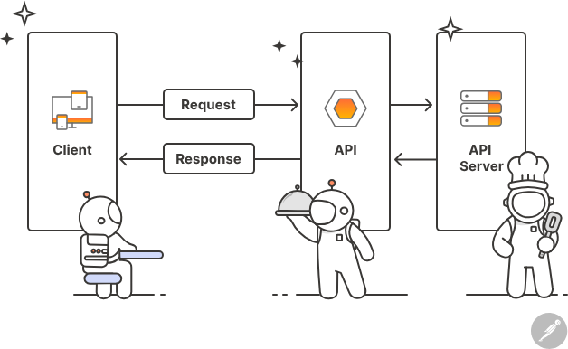

*//------------------------------------------------------------INTRO TO RUBY ON RAILS------------------------------------------------------------//*

 # FRONTEND V.S. BACKEND, AND SYSTEM DESIGN:
   - Frontend Development (AKA client-side development) is the practice of using HTML, CSS and JavaScript for a website / web application so that a user can see and interact directly with them.
     * The challenge with Frontend is that the techniques and tools used to create the frontend are constantly changing.
     * Developers must be constantly aware of how the field is developing.
     * Core concepts of the frontend are as follows:
         + HTML / CSS / JavaScript: These are the core technologies behind every webpage. HTML (HyperText Markup Language) dictates the structure, CSS (Cascading Style Sheets) sets the visual appearance, and JavaScript makes the page interactive.
         + Responsive Design: Websites must work well on multiple devices (phones, tablets, computers, laptops, etc.) requiring and understanding of responsive design principles.
         + Performance Optimization: Ensuring that websites are fast and efficient.
         + Frameworks and Libraries: Knowledge of frameworks like React, Angular, or Vue.js is often essential.
         + There is more, but these are the BIG concepts.
   - Backend Development (AKA server-side development) focuses on databases, scripting, and website architecture.
     * This is where all the magic happens that allows websites to function.
     * Backend works in tandem with frontend to deliver the final product to the end-user.
     * Some of the core concepts of backend are as follows:
         + Languages: Java, Python, Ruby, Node.js, PHP, .NET, and more.
         + Database Management: Understanding database management systems like SQL, MongoDB, or Oracle are essential
         + Server Management: Understanding server management and architecture is crucial. This includes handling Apache, Nginx, and similar platforms.
         + APIs (Application Programming Interfaces): APIs are critical for communication between the frontend and backend.
         + There are more, but these are the BIG concepts.
   - System Design, in the context of web development, focuses on the architecture of the system.
     * Specifically, it is about designing a system to handle loads efficiently and to scale as necessary.
     * This involves optimizing the code, database queries, and employing caching strategies as well as managing servers and networks.  
     * The following are some questions regarding system design:
         + Design a Simple Blogging Platform
             - How would you design a basic blogging platform where users can create and read blog posts?
             - What kind of database would you choose (SQL or NoSQL) for storing blog posts and user information. Why?
             - How would you ensure that the platform can handle an increase in the number of users and blog posts over time?
         + Design a Task Management Application\
             - How would you design a simple application for managing tasks and to-do lists?
             - What would be your approach to store and retrieve tasks efficiently?
             - Consider how multiple users might use the application simultaneously. How would your design accommodate this?
     * When it comes to frontend and backend, there's also a side of system design that comes into play.
   - Together, frontend and backend, form the backbone of the web.
   - Both are essential to the web and they both require a lot of skill and knowledge to do both well.
   - This is why it takes a team of developers to build a web application. It's not something that can be done by one person alone within a reasonable amount of time.

 # OTHER SKILLS FOR WEB DEVELOPMENT:
   - Design: Design is critical for web development because it's what makes a website look good and function well.\
     * Designers need to understand color theory, typography, and user experience (UX). 
   - Testing: Making sure that a website works as intended.
     * Testers need to understand how to write test cases, how to run tests, and how to report bugs.
     * Testing allows us to ensure that our code is working as intended and can save a lot of time and money. 
   - Project Management / DevOps: Making sure that a website is delivered on time and on budget.
     * Project managers / DevOps need to understand how to plan projects, manage teams, and communicate with clients. 
   - Security
     * Making sure that a website !!WHY ARE ALL OF THESE THE SAME!! 
   - Of course, there are more but these are the "larger" skills.

 # OVERVIEW OF COMMON FULL STACK TECHNOLOGIES:
   - Frontend:
     * HTML / CSS: Building blocks of web development
     * JavaScript: Essential for adding interactivity to web pages.
     * Frameworks: Angular, ReactJS, and Vue.js for advanced JS handling.
     * Libraries: jQuery, Bootstrap for UI components and faster development.
   - Backend:
     * Languages: Node.js (JavaScript), Ruby, Python, PHP, Java
     * Frameworks: Express (for Node.js), Django (Python), Ruby on Rails (Ruby)
     * Databases: MySQL, MongoDB, Oracle, SQLServer 
     * Server Management: Knowledge of AWS, Heroku, etc.
   - DevOps and Version Control: 
     * Git: For version control
     * DevOps Tools: Docker, Jenkins, Kubernetes 
   - Testing and Debugging: 
     * Unit Testing: JUnit (Java), Jest (JavaScript)
     * Debugging Tools: Chrome DevTools, Visual Studio Code Debugger.

 # UNDERSTANDING THE INTERNET AND WEB SERVERS:
   - The internet is a vast network of computers and servers interconnected globally. 
   - It is the infrastructure that allows devices to connect and communicate with each other.
   - There is something called data transmission in which data is sent from one device to another through a system of standardized protocols.
   - These protocols are a set of rules that define how data is transmitted between in a network.
   - The most common protocol is TCP/IP (Transmission Control Protocol/Internet Protocol) which is the protocol that allows the internet to work.
   - In regards to transferring data over the internet, there are two types of devices: clients and servers.
   - Clients are devices that request data from servers.
   - Servers are devices that store and send data to clients.
   - Ex: You computer is the client and the website has a server.
     * Your computer requests data from the server and the server send the data back to your computer. 
     * Data refers to files like HTML, CSS, JavaScript, images, videos, etc.
   - Web Servers:
     * Function: Web servers are powerful computers that store web site files and serve them to users on request.
     * Software: They run software like Apache, Nginx, which handles the incoming requests from clients and responds with the requested pages.
   - Clients:
     * Web Browsers: Clients, typically web browsers like Chrome of Firefox, request information from servers.
     * Request-Response Cycle: When you type a website address or click a link, your browser sends a request to the server hosting the site, which then responds with the site's files.

 # IP ADDRESSES AND DNS:
   - Web sites get online through web hosting. 
     * Web hosting is a service that allows individuals to make their websites accessible via the World Wide Web.
   - Deployment is the process of making a website available to the public.
     * It is the process of uploading files to a web server and making them accessible via the World Wide Web.
     * The files are the HTML, CSS, JavaScript, images, videos, etc.
   - If you were to deploy an API, you would be uploading files that contain code that allows other applications to interact with your application.
   - In essence, it is a matter of uploading files to a web server and making them accessible via the World Wide Web.

 # HTTP REQUESTS AND RESPONSES:
   - Basics of HTTP Protocol:  
     * Clients and servers communicate through HTTP (Hypertext Transfer Protocol): The protocol that allows clients and servers to communicate with each other.
     * When you visit a website, your computer sends an HTTP request to the website's server.
     * The server then sends an HTTP request back to your computer.
     * HTTP is the backbone of communication on the World Wide Web.
     * It is a request-response protocol in the client-server computing model.
     * A web browser may be the client, and an application running on a computer hosting a website may be the server.
       + Client request: A user opens a web browser, types in a URL, and presses Enter. The browser sends an HTTP request to the server.
       + Server response: The server processes the request and sends back a response. The response contains a status line such as "HTTP/1.1 200 OK" and a message body, which is often the requested resource (such as an HTML document).
   - HTTP Methods: There are different types of requests your browser can make toa  server. The type of request is determined through an HTTP method.
     * GET: Requests data from a specified resource. It should only retrieve data and should have no other effect.
     * POST: Sends data to the server for a new resource to be created. It is often used when submitting form data or uploading a file.
     * PUT: Replaces all current representations of the target resource with the uploaded content.
     * DELETE: Removes the specified resource.
     * HEAD: Similar to GET, but it asks for a response identical to that of a GET request, without the response body.
   - A resource is described as a location or object that is capable of being identified by a Uniform Resource Identifier (URI).
     * Examples of resources include HTML docs, images, videos, style sheets.
   - A URI is a string of characters that unambiguously identifies a particular resource.
   - To access a resource, a client sends a request to a server.
   - The most common type of request is an HTTP GET request, which is used to retrieve data from a specified source.
   - The server then sends back a response, which contains status information about the request and may also contain the requested content.

 # HTTP STATUS CODES:
   - Status codes are issued by a server in response toa client's request made to the server.
   - They are part of the HTTP response message and indicate whether a specific HTTP request has been successfully completed.
   - Responses are grouped into 5 classes:
     * Informational responses (100-199)
     * Successful responses (200-299)
     * Redirection messages (300-399)
     * Client error responses (400-499)
     * Server error responses (500-599)
   - Why does a status code matter?
     * Communication: They provide a quick way for the server to tell the client about the status of the request, such as success, failure, or need for redirection.
     * Debugging: They are crucial for diagnosing issues in HTTP communication, especially when a request fails.
     * Automation: They are used by scripts and applications to understand the response from the server and act accordingly. 
       + Ex: A 200 OK status code indicates that the request was successful, while a 404 Not Found status code indicates that the requested resource was not found.

 # REST AND RESTful APIs:
   - 
   - APIs are a huge part of web development that allow developers to build applications that interact with other applications.
   - They are the glue that holds the web together and without them, the web would be very different.
   - APIs are everywhere and are used by companies like Google, Facebook, Twitter, and Amazon.
   - There are also different style of API, and we will work with REST.

 # REST:
   - When constructing a backend to be able to receive requests, there are a few ways to make this possible:
     * SOAP (Simple Object Access Protocol)
     * XML-RPC
     * REST (Representational State Transfer)
     * GraphQL
     * Custom structured
   - REST is widely used and is the most common way to build APIs.
   - REST is an architectural style for designing APIs.
   - REST is a set of guidelines that developers can follow when building APIs.
   - REST is based on the idea that everything is a resource and can be accessed using a unique identifier (a URI).
     * Ex: A user is a resource and can be accessed using a URI like /users/1
   - REST is also stateless, meaning that each request can be processed independently of the previous one. Making REST very scalable and easy to maintain.
   - What makes an API RESTful?
     * Resources
     * HTTP Methods
     * Status Codes
     * Stateless
     * Caching
   - When it comes to building REST APIs, endpoints (or routes) are the most important part.
   - They are a part of the URL that clients use to access resources.
     * Ex: if you send a GET request to /users/1 and the user exists, you would get a 200 OK response with a link to the user's profile page or data in return. If the user doesn't exist, you would get a 404 Not Found response with a link to the user's profile page.

 # URLs:
   - URL (Uniform Resource Locator) is a string of characters that unambiguously identifies a particular resource.
     * A user is a resource and can be found using a URL like /users/1
   - A URL is made up of 3 parts:
     * Protocol
     * Domain name
     * Path
   - Ex: the URL https://www.example.com/users/1 has:
     * Protocol: https
     * Domain Name: www.example.com
     * Path: /users/1
   - There are query parameters which are used to pass additional information to the server.
   - Query parameters often filter data.
     * Ex: https://www.example.com/users?age=30 would specify all users who are 30 years old.
   - You can attach multiple queries at once.

 # RESTful ENDPOINTS:
   - An endpoint is a ULR that clients use to access resources in the context of an API.
     * This was previously mentioned as a path.
   - RESTful endpoints are not just URLs, they are also HTTP methods
   - The following is a table of the most common RESTful endpoints:

  |===========|================|==========================================|
  |HTTP Method|    Endpoint    |               Description                | 
  |-----------|----------------|------------------------------------------|
  |    GET    |    /users/     |          Returns a list of users         |
  |-----------|----------------|------------------------------------------|
  |    GET    |   /users/1/    |          Returns a specific user         |
  |-----------|----------------|------------------------------------------|
  |    POST   |    /users/     |             Creates a new user           |
  |-----------|----------------|------------------------------------------|
  |    PUT    |    /users/1    |             Updates a new user           |
  |-----------|----------------|------------------------------------------|
  |   DELETE  |    /users/1    |          Deletes an existing user        |
  |===========|================|==========================================|

 # RUBY ON RAILS INTRODUCTION:
   - Ruby on Rails is a web application framework written in Ruby that is designed to make building we applications easier by making assumptions about what every developer needs to get started.
   - It allows you to write less code while accomplishing more than many other languages and frameworks.
   - It is one of the most popular web frameworks in the world.
   - Although it is a framework, rails is a gem in Ruby.
     * A gem is a package that contains Ruby code.
     * It's similar to a Node.js module or a Python package. 
   - Rails is a Model-View-Controller (MVC) framework.
   - The MVC pattern is a software design pattern that separates the representation of information from the user's interaction with it.
   - It's a way to organize code into 3 distinct parts:
     * Models: Responsible for managing the data of the application. They are the interface between the application and the database. They are also responsible for validating data and enforcing business rules.  
     * Views: Responsible for displaying data to the user. They are the interface between application and the user and are also responsible for handling user input.
     * Controllers: Responsible for handling requests and generating responses. They are the interface between the application and the web server and are also responsible for handling business logic.
   - Rails is a full-stack framework, meaning it provides everything you need to build a web application, both frontend and backend.
   - It includes a router, a controller, a model, a view, a database.
   - It also includes other features such as a built-in testing framework, and a built-in debugging framework. 
   - We will only be focusing on the backend portion of Rails since we will be building RESTful API and leveraging other powerful tools to build the frontend.

 # ADVANTAGES TO RAILS:
   - Convention over configuration: Rails makes assumptions about what every developer needs to get started. It allows you to write less code while accomplishing more than many other languages and frameworks.
   - Full-stack framework: Rails provides everything you need to build a web application
   - Active Record: Rails uses a database abstraction layer called Active Record which allows you to interact with the database using Ruby objects instead of SQL queries.
   - Gems: Rails has a lot of gems that you can use to add functionality to your application.
     * Ex: There are gems for authentication, authorization, and pagination.
   - Community: Rails has a large active community so there are a lot of resources available online (tutorials, screencasts, and books)  
   - Open Source: Rails is open source, which means that anyone can contribute to it, so you can fix bugs, add features and improve documentation.
   - Fast development: Rails is designed to make building web applications fast and easy.

 # DISADVANTAGES TO RAILS:
   - Ruby on Rails as a full-stack framework is not as flexible as other frameworks.
   - Performance: Rails can be slower compared to frameworks written in compiled languages like Java or C#. This might be a concern for high-performance applications.
   - Learning Curve: While Rails itself is easy to pick up, mastering Ruby and understanding the "Rails Way" of doing things (CoC and DRY) can be challenging.
   - Memory Usage: Rails applications can consume more memory compared to other frameworks, which might be an issue for memory-sensitive environments.
   - These disadvantages are not deal-breakers, but are worth considering when choosing a framework for your next project.

 # INSTALLING RUBY ON RAILS:
   - Ruby on Rails must be installed on your computer to be used.
   - To install Ruby on Rails, you need to have Ruby installed.
   - To install Ruby, you need to have WSL (Windows Subsystem for Linux) installed.
   - Once WSL and Ruby are installed, run gem install rails through the WSL terminal.

 # CREATING A NEW RUBY ON RAILS PROJECT:
   - There are 2 ways to create a Rails project:
     1. rails new <project_name>
       * This will create a new Rails project with the name you specified. Be sure to use snake_case.
       * This command will create a new Rails project, but it will bet setup to be used as a full stack project.
     2. rails new [project_name] --api
       * This will create a new Rails project that is configured and setup to be used as a RESTful API.
   - The difference between the two is that a full stack project will include a lot of files and folders that we won't be using.
   - Another difference is that a full stack project will include a lot of gems that we won't be using.

 # RAILS DIRECTORY STRUCTURE:
   - When we create a new Rails project, it will create a lot of files and folders.
     * Rails will create a git repository for us.
     * app: This is where we will be spending most of our time. The folder contains the following sub-folders:
       + channels: Contains the Action Cable channels for our application. Action Cable is a framework for real-time communication over WebSockets.
       + controllers: Contains the controllers for our application. Active Job is a framework for declaring jobs and making them run on a variety of queuing backends.
       + mailers: Contains the mailers for our application. Mailers are responsible for sending emails.
       + models: Contains the models for application. Models are responsible for managing the data of the application.
       + views: Contains the views for our application. Views are responsible for displaying data to the user. However, when it comes to building a RESTful API, we won't be using this folder other than crafting our own email template.
     * bin: Contains the rails executable, which is used to run commands like rails server and rails console.
       + The rails server command is used to start the Rails server. The Rails server is a web server that runs our application.
       + The rails console command is used to start the Rails console. The Rails console is an interactive Ruby shell that allows you to interact with our application and the database.
     * config: Contains the configuration files for our application, such as routes.rb, database.yml, and application.rb
       + The routes.rb is used to define the routes for our application. Routes are used to map URLs to controllers and actions.
       + The database.yml is used to configure the database for our application. Rails uses SQLite3 as the database by default. 
       + The application.rb is used to configure the application for our application. It's where we can configure things like the default locale, the default time zone, and the default encoding.
     * db: Contains the database schema and migrations for our application.
       + By default when creating a new Rails project, it will use SQLite3 as the database. We will be using SQLite3 since it is lightweight and compatible with multiple devices.
     * lib: Contains the code that is shared between different parts of our application. We can put our custom validators in the lib/validators folder.
     * log: Contains the log files for our application. This is where we can find information about what's happening in our application when it's running. We can either rind this wile running the server or when we deploy our application to a server.
     * public: Contains the static files of our application like images, JavaScript, and CSS.
     * storage: Contains the files that are uploaded by users.
     * test: Contains tests for our application.
     * tmp: Contains temporary files for our application.
     * vendor: Contains third-party code that is not managed by Bundler.

 # USING RAILS CLI TO GENERATE A MODEL:
   - Models are responsible for managing data of the application.
   - Ruby on Rails has a built-in ORM (Object Relational Mapping) called Active Record which allows us to interact with the database using Ruby objects instead of SQL queries.
   - Models are also responsible for validating data and enforcing business rules.
     * Business rules are rules that are specific to the business.
     * Ex: We might want to enforce a rules that says a user can't have the same email address as another user.
   - To create a model, we can use the rails generate model command:
     * rails generate model User name:string email:string
   - rails generate model: The rails command that is use to generate a model.
   - User: The name of the model. It's convention to uses singular nouns for model names.
   - name:string email:string: Attributes of the model. They are used to define the columns of the database table.
     * The first part is the name attribute and the second part is the type of the attribute.
     * In this case, we are using string type. Other types are integer, float, decimal, datetime, and boolean.
   - This creates a new model called User which includes a series of files like app/models/user.rb.
   - It will also create a migration system file for the User model.

 # MIGRATIONS:
   - A Migration is a ruby class that is used to make changes to the database. It's a way to update the database schema.
     * Ex: We can use migrations to create tables, add columns, and remove columns.
   - Inside the migration file, navigate to the db/migrate folder and open the migration file within migrate that was just generated.
   - This file should look similar to this: 20240110170144_create_users
   - This file should look similar to this:

class CreateUsers < ActiveRecord::Migration[7.0]
  def change
    create_table :users do |t|
      t.string :name
      t.string :email

      t.timestamps
    end
  end
end

 # EXAMPLE MIGRATION: 
  - class CreateUsers < ActiveRecord::Migration[7.0]: 
     * This is the name of the migration class.
     * It is convention to use the name of the model followed by the name of the migration.
     * In this case, the model is User and the migration is CreateUsers.
     * The migration class inherits from the ActiveRecord::Migration class.
     * This is the bass class for all migrations.
   - change method:
     * This is the method that is used to make changes to the database.
     * It's a method that is defined in the ActiveRecord::ConnectionAdapters::SchemaStatements class.
   - :users: 
     * The name of the table. 
     * It's convention to use the plural form of the model name.
   - t.string:name and t.string:email:
     * The name of the column.
     * It's convention to use the singular form of the attribute name.
   - t.timestamps:
     * Shortcut for creating two columns called created_at and uploaded_at.
     * These columns are used to store the date and time of when a record is created and updated.
   - There are a wide variety of data types that we can use for our columns:
     * string
     * text
     * integer
     * float
     * decimal
     * datetime
     * boolean
     * binary
     * json
     * etc.

 # MIGRATIONS cont:
   - The file name for migration files are prefixed with a timestamp.
   - This is used to determine the order in which migrations are applied.
     * Ex: If we have 2 migration files with the same timestamp, Rails will apply them in alphabetical order.
       + This is important because migrations can depend on each other.
     * Ex: If we have a migration that adds a column to a table and another migration that removes the same column from the same table, Rails will apply the first migration before the second one. This is called migration dependency.
   - DO NOT delete or modify migration files. If you need to make changes to a migration file, you should create a new migration file instead.
   - Because Rails uses the migration files to determine the current state of the database, deleting/modifying migration files will cause Rails to be unable to determine the current state of the database.
   - Since we generated the creation of a file using Ruby on Rails command, it doesn't automatically create the table in the database. We need to run the migration file to create the table in the database.
   - To run the migration file, we use the rails db:migrate command.
   - This will run all the pending migrations.
     * Pending migrations are migrations that haven't been run yet.
   - Running the command will execute the migration file we have created. It will create the users table in the database.
   - You should see something like what is shown below:

== 20231230191708 CreateUsers: migrating ======================================
-- create_table(:users)
   -&gt; 0.0018s
== 20231230191708 CreateUsers: migrated (0.0019s) =============================

   - What if we made a mistake and like to modify our migration file? 
   - This is done by running the rails db:rollback command
   - This will rollback the last migration and reset the state of the migration file back to pending.
   - It will remove the suers table from the database since that was the last migration we ran.
   - You should see something similar to what is shown below:

== 20231230191708 CreateUsers: reverting ======================================
-- drop_table(:users)
   -&gt; 0.0018s
== 20231230191708 CreateUsers: reverted (0.0019s) =============================

   - Sometimes we may want to rollback multiple migrations.
   - We can do that by specifying the number of migrations we want to rollback.
     * Ex: If we want to rollback the last 2 migrations, we can run the rails db:rollback STEP=2 command.

 # SCHEMA:
   - Now that we have created the users table in the database, we need to look at the schema file.
   - The schema is essentially a representation of the database.
   - It will include all the tables and columns that are in the database.
   - We never have to manually modify this file.
   - It is automatically generated by Rails and it's used to determine the state of the database.
   - If at any point we want to modify the database, we can do that by creating a new migration file like we did before.
   - Upon running db:migrate, it will change the schema file.
   - The schema file generated for our project should look like this:

 ActiveRecord::Schema.define(version: 20231230191708) do

  create_table "users", force: :cascade do |t|
    t.string "name"
    t.string "email"
    t.datetime "created_at", precision: 6, null: false
    t.datetime "updated_at", precision: 6, null: false
  end

end

 # SCHEMA EXAMPLE:
   - ActiveRecord::Schema.define: The name of the schema class
   - version: 20231230191708: This is the version of the schema. It is used to determine the state of the database. It is a timestamp that is generated when we run the rails db:migrate command.
   - create_table "users": The method that is used to create a new table in the database. It's a method that is defined in the ActiveRecord::ConnectionAdapters::SchemeStatements class.
   - t.string "name" and t.string "email": Method that is used to create a new column in the database. It's a method that is defined in the ActiveRecord::ConnectionAdapters::SchemeStatements class.
   - t.datetime "created_at" and t.datetime "updated_at": Shortcut for creating two columns called created_at and updated_at. These column are used to store the date and time when a record is created and updated.
   - force: :cascade: An option that is used to drop the table before creating it. This is useful when we want to reset the state of the database.
   - precision: 6: An option that is used to specify the precision of the datetime column. It's used to store the date and time of when a record is created and updated.
   - null: false: An option used to specify that the column cannot be null. This is useful when we want to enforce business rules.

 # SCHEMA cont:
   - What is interesting as well is the table does not indicate the primary key. 
   - This is because Rails automatically creates a primary for us. It's called id and it's an integer.
   - It's also auto-incremented meaning that every time we create a new record the id will be incremented by one.

 # INTERACTING WITH THE DATABASE WITH MODELS:
   - Rails uses a database abstraction layer called ActiveRecord, also referred to as ORM (Object Relational Modeling)
   - It allows us to interact with the database using Ruby objects instead of SQL queries.
     * Ex: We can use the User model to create, read, update, and delete users.
     * We can also use the User model to validate data and enforce business rules.
   - This is important because it allows us to write less code while accomplishing more than what other languages and frameworks.
   - It is also easier to  maintain our application since we don't have to worry about writing SQL queries.
   - With Rails, the way we can use the ORM is if we define the correct files and folders in the right spot.
   - Since we ran the command rails generate model User name:string email:string, it created a file under app/models/user.rb. This is where we define our model.

*//----------models/user.rb----------//*
class User < ApplicationRecord
end
*//----------------------------------//*

   - ApplicationRecord is a class that is defined in the ActiveRecord::Base class. It is the base class for all models. We can define methods that are used to validate data and enforce business rules.
   - class User < ApplicationRecord: The name of hte model class. It's convention to use the name of hte model followed by the name of the model. The class name is important because it's used to determine the name of hte table we will be interacting with.

 # INTERACTING WITH THE DATABASE WITH MODELS cont:
   - In this class, we can define methods that include business logic, validations and callbacks
   - Naming of files and folders is VERY important in Rails. If we don't name them correctly, Rails will not be able to find them.
     * Ex: If we name the model file usurs.rb instead of users.rb, Rails won't find it.
     * This is because Rails uses the naming convention to determine where to look for files and folders.
   - Same goes for naming of the class.

 # MODEL METHODS:
   - To interact with the database, we use the rails console command: rails c
   - This will start the Rails console, which is an interactive Ruby shell that allows us to interact with our application and the database.
   - It's similar to the Rails server, but it's used for debugging purposes or to access the database instead of running the application.
   - If we choose to exit the console to go back to the terminal, run the exit command.
   - When models are created, it is best practice to ensure that the table, columns, files and everything that is needed is created to access the table in the database through active record.
   - To interact with the table, we need to know the name of the model class.
   - In this case, the model class is User which is defined in the app/models/user.rb file.
   - To create a new user, we run the following command
     * [Model].create([column1]:[data], [column2]:[data])
     * For our application it would be: User.create(name: "John Doe", email "johndoe@gmail.com")
       + User: This is the name of the model that is defined.
       + create: This is the method that is used to create a new record (also referred to as a row in the table) in the database. It's a method that is defined in the ActiveRecord::Persistence class.
       + Since our model has 2 attributes, we need to specify the values for both of them. This is done by passing in a hash with the attribute names as keys and the attribute values as values.
       + In this case, we are passing in a hash with the name and email attributes.
       + This is called hash literal and it's a way to create a hash without using the Hash.new method.
   - Now we want to find the user we just created. This is done by entering in the following command:
     * User.find(1)
     * This will find the user with the id 1 in the database and return the user object.
   - The return value of the find method is an object of the User class. To access the attributes of the user, we use the dot notation.
   - Access Attribute:
     * user = User.find(1)
       user.name 
   - Update: 
     * user = User.find(1)
       user.update(name: "Jane Doe", email "janedoe@gmail.com).
   - Delete:
     * user = User.find(1)
       user.destroy
   - All:
     * User.all

 # MODEL CLASS METHODS:
   - find_by: Used to find a record by specific attribute.
   - count: Used to count the  number of records.
   - first: Used to find the first record.
   - last: Used to find the last record. 
   - all: Used to find all records.
   - where: Used to find records by a specific attribute.
   - where.not: Used to find records by a specific attribute.
   - order: Used to order records by a specific attribute.
   - limit: Used to limit the number of records.
   - offset: Used to offset the number of records.

 # VALIDATIONS:
   - Validations are used to validate data and enforce business rules. 
     * Ex: We can use validations to ensure that a user has a name and an email address.
   - There are different types of validations we can enforce. 
     * We can enforce validations on the database level 
     * We can enforce validations on the model level
   - Database Level:
     * The most basic validation.
     * Used to ensure that the data in the database is valid.
       + Ex: We can use database level validations to ensure that a user has name and email address. 
       + We can also use database level validations to ensure that a user's email is unique.
     * Database level constraints are important for maintaining data integrity, especially in larger applications or in applications where the database might be accessed by different services or applications     
   - Model Level:
     * The most common type of validation.
     * It's used to ensure that the data in the model is valid.
       + Ex: We can use model validations to ensure that a user has a name and an email address.
       + We can also use model level validations to make sure each user's email is unique.
     * Model-level validations alone might not be sufficient in cases where multiple applications interact with the same database as each application might have different validation rules or might bypass validations entirely.
   - Why is there both?
     * Having both database and model-level validations offers multiple layers of security.
     * Database-level validations act as a final safeguard ensuring data integrity at the most fundamental level.
     * Model-level validations provide a more user-friendly and flexible way to enforce rules and business logic.
   - Frontend validations are also beneficial, as they help reduce unnecessary server requests.
   - This enhances user experience by eliminating the need for users to wait for server responses to each error.
   - Initial validators are performed on the client side for immediate feedback, followed by more comprehensive validations on the backend. 
   - Let's add some validations to our User model:

*//----------models/user.rb----------//*
class User < ApplicationRecord
  validates :name, presence: true
  validates :email, presence: true, uniqueness: true
end
*//----------------------------------//*  

   - validates :name, presence: true: This is the method that is used to validate the name attribute. it takes 2 arguments: the name and the validation rule.
     * In our case, we use the presence rule to make sure that the attribute is present (not nil or na empty string)
   - If we try to create a user without a name, we will get an error because we have a presence validation on the name attribute of our model.

 # MORE MODEL VALIDATORS:
   - format: { with:[specified expression] }: Checks if the value of an attribute matches a given regular expression.
   - length: { minimum: 5, maximum: 20 }: Ensures that the length of the attribute's value is within a specified range.
   - numericality: { greater_than: [#] } Ensures that the attribute's value is a number, and can also validate if it is greater than, less than, equal to, odd, even, etc.
   - inclusion: { in %wl[pending approved rejected] }: Validates that the value of the attribute is included in or excluded from a given set.
   - absence: true: Validates that the specified attributes are empty or nill.
   - confirmation: true: Used mainly for passwords and emails, ensuring that two text fields receive exactly the same content.
   - :terms_of_service, acceptance: true: Checks if a checkbox is checked.

 # CuSTOM MODEL VALIDATORS:
   - Custom validators are used to validate data and enforce business rules.
   - Let's add some validators to the User model.
   - Navigate to the app/models/user.rb file and add the following code:

*//----------models/user.rb----------//*
class User < ApplicationRecord
  validate :name_cannot_contain_numbers

  def name_cannot_contain_numbers
    if name.match(/\d/)
      errors.add(:name, "cannot contain numbers")
    end
  end
end
*//----------------------------------//* 

   - validate :name_cannot_contain_numbers: The method used to add a custom validator.
   - This is the method that is used to add a custom validator:

      def name_cannot_contain_numbers
        if name.match(/\d/)
          errors.add(:name, "cannot contain numbers")
        end
      end
  
   - The custom method validates the name attribute so if the name contains any numbers, we add an error.
   - Add a error attribute will result in being able to access the error message.
     * Ex: If we try to create a new user with the name "John Doe123", we will get an error.

 # CALLBACKS:
   - Callbacks are used to execute code before or after certain events.
   - An example would be using callbacks to send an email after a user is created.
   - There are also different types of callbacks:
     * Before / after certain events: 
       + This is the most basic type of callback and it is used to execute code before/after certain events
       + Ex: We can send an email after a user is created.
     * Before / after certain actions:
       + This is the most common callback and it's used to execute code before or after certain actions.
       + Ex: Send an email before a user is created.
   - These both exist because having both callbacks offers multiple layers of security.
   - Before callbacks act as a final safeguard ensuring data integrity at the most fundamental level.
   - After callbacks provide a more user-friendly and flexible way to execute code before or after certain events.

*//----------BEFORE Callback----------//*
class User < ApplicationRecord
  validates :name, presence: true
  validates :email, presence: true, uniqueness: true

  before_create :downcase_email

  private

  def downcase_email
    self.email = email.downcase
  end
end
*//-----------------------------------//*

 # BEFORE EXAMPLE:
   - before_create :downcase_email: The method that is used to add a callback.
     * In this case, we are using the before_create callback, which means that the method will be called before the record is created.
     * We are also using downcase_email method, which means that the email attribute will be downcased before the record is created.  

 # INTRODUCTION TO ASSOCIATIONS:
   - Associations are used to define relationships between models.
   - Ex: We can use associations to define a one-to-one relationship between a user and a profile.
   - We can also use associations to define a one-to-many relationship between a user and a post.
   - Active record makes it unbelievably easy to define these relationships.
   - All we have to do is follow the naming convention and Rails will take care of the rest.

 # DIFFERENT TYPES OF ASSOCIATIONS:
   - One-to-One
     * The most basic type of association.
     * Used to define a 1:1 relationship between two models.
     * Ex: A user only has one profile, so we define a One-to-one relationship between the user and profile models through association. 
   - One-to-Many
     * This is the most common type of association.
     * Used to define a 1:N relationship between two models.
     * Ex: A user can have many posts, so we define a One-to-many relationship between the user and posts models through association. 
   - Many-to-many
     * This is the most complex type of association.
     * Used to define a Many-to-many relationship between two models.
     * Ex: A user can be part of many groups and many groups can have many users, so we define a many-to-many relationship between user and group models through association. 
   - Polymorphic
     * The most advanced type of association.
     * Used as a way to set up a single model that can belong to more than one model, using single association.
     * Ex: A comment can be associated with a post or video. 
   - Self-join
     * Another advanced type of association.
     * Used to define a self-join relationship between two models.
     * Ex: We can use associations to define a self-join relationship between a user and a friend.

 # ONE-TO-ONE: BELONGS TO AND HAS ONE ASSOCIATIONS:
   - First, we need to create a profile table.
   - This is done through the Rails console by using the following command:
     * rails g model Profile user:references bio:text
       + Profile: The name of the model
       + user:references: Type of the attribute.
         - Used to define a one-to-one relationship between 2 models
         - The attribute will be a reference to another model
         - In this case, we are referencing the User model.
         - This will create a user_id column in the profiles table.
     * bio:text: Name of the attribute and the type of attribute  
   - Second, we will need to add an association with the User model:

*//----------models/profile.rb----------//*
class Profile < ApplicationRecord
  belongs_to :user
end
*//-------------------------------------//* 

   - belongs_to :user: The method that is used to add a belongs_to association.
     * It takes 2 arguments: the name of the association and the options.
     * In this case, we are using the belongs_to association, which means that the profile belongs to a user.
     * We are also using the user method, which means that the profile belongs to the user.
     * This will create a user method that returns the user associated with the profile. 
   - Now navigate to app/models/user.rb and add the following code:   

*//----------models/user.rb----------//*
class User < ApplicationRecord
  validates :name, presence: true
  validates :email, presence: true, uniqueness: true

  before_create :downcase_email

  has_one :profile

  private

  def downcase_email
    self.email = email.downcase
  end
end
*//----------------------------------//* 

   - has_one :profile: The method that is used to add a one-to-one relationship.
     * It takes 2 arguments: the name of the association and the options.
     * In this case we are using has_one association, which means the user has oen profile.
     * We are also using the profile method, which means that the user has one profile.
     * This will create a method that returns the profile associated with the user.

 # ONE-TO-MANY: BELONGS TO AND HAS MANY ASSOCIATIONS:
   - One-to-one relationships include a belongs_to and has_one association.
   - One-to-many relationships include a belongs_to and has_many association.
   - Since we have a user table, we will need to create a post table by running the following command:
     * rails g model Post user:references title:string body:text published:boolean published_at:datetime
       + Post: Name of the model
       + user:references: Used to define a one-to-many relationship.
         - We are using the references type, which means that the attribute will be a reference to another model.
         - In this case, we are referencing the User model, so this will create a user_id column int  he posts table.   

*//----------models/post.rb----------//*
class Post < ApplicationRecord
  belongs_to :user
end
*//----------------------------------//* 

*//----------models/user.rb----------//*
class User < ApplicationRecord
  validates :name, presence: true
  validates :email, presence: true, uniqueness: true

  before_create :downcase_email

  has_one :profile
  has_many :posts

  private

  def downcase_email
    self.email = email.downcase
  end
end
*//----------------------------------//* 

   - has_many :posts: This is the method that is used to add a one-to-many relationship
   - It takes 2 arguments: The name of the association and the options.
   - In this case, we are using the has_many association which means that the user has many posts
   - We are also using the posts method, which means that the user has many posts.
   - This will create a posts method that returns the posts associated with the user.
   - Now that we have our setup, let's create a new user with a post by running the follow